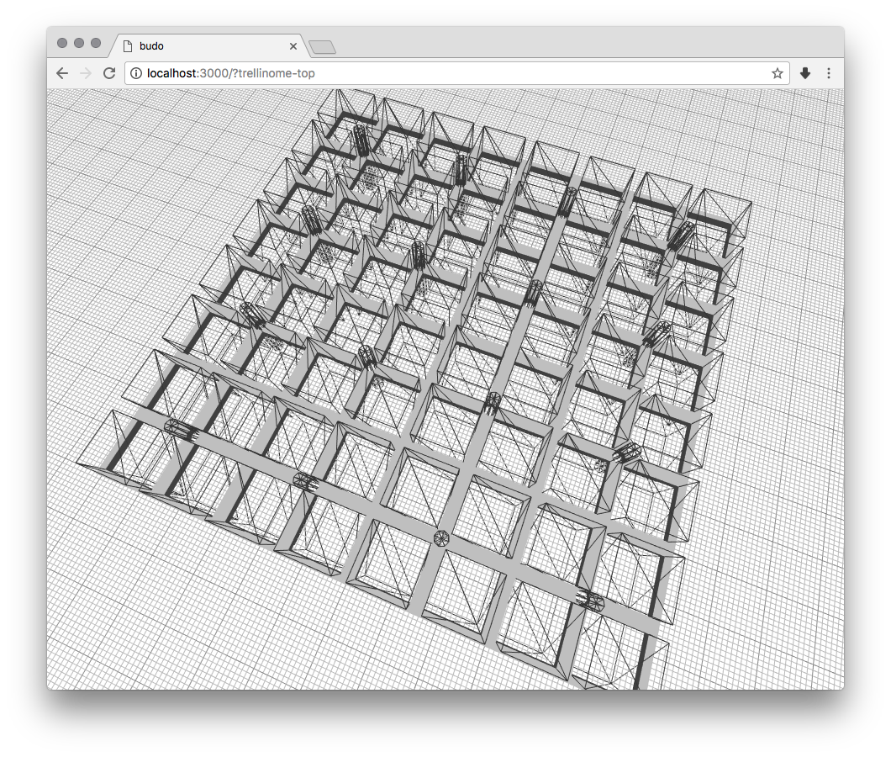

# DIY Monome

This repo contains *some* tools for building and running DIY version of [monome](https://monome.org/) 8x8 grid, that's *mostly* compatible with existing monome patches and software.

There are actually two projects in this repo: **Sparknome** which is based on four [Sparkfun PCBs](https://www.sparkfun.com/products/8033), and **Trellinome** based on four [Adafruit Trellis boards](https://www.adafruit.com/product/1616). At the moment of writing both boards cost less than 10USD (per board), and both require some soldering (Sparkfun boards need more than Adafruit). I was able to get Trellinome fully working, and Sparknome semi-working due to soldering problems.

**Sparknome** on right, **Trellinome** on left

These boards are not a replacement for official monome build (that is much nicer hardware, and supports variable brightness), but just a DIY project.

## Sparknome

Sparknome is based on Arduino Mega 2560 due to huge amount of digital pins used (that could be fixed with multiplexer though). I followed official [assembly guide](https://learn.sparkfun.com/tutorials/button-pad-hookup-guide), connecting four boards by joining the adjacent rows and columns. I used RBB LEDs, but wired only single colour (connecting other legs to GND), since monome doesn't support RGB.

The Arduino code to drive the display is in [Sparknome](Sparknome) folder.

## Trellinome

Trellinome was simpler to assemble than Sparknome, because there's much less wiring. It's also harder to make a mistake soldering here. I connected adjacent boards by connecting the SDA, SCL, GND, 5V and INT pins ([learn.adafruit.com/adafruit-trellis-diy-open-source-led-keypad](https://learn.adafruit.com/adafruit-trellis-diy-open-source-led-keypad)).

Since this boards require only few pins to be controlled, I could use smaller Arduino - I went with Pro Mini 5V.

The Arduino code to drive the display is in [Trellinome](Trellinome) folder.

## Arduino & Hardware & Mext

Recent Monomes use `mext` protocol to communicate OSC with serial data: [Mext Serial Codes](Mext%20Serial%20Codes.txt). Few years ago there was a "Arduinome" project, but it uses pre-mext protocol, and is not compatible with most Max/MSP patches for example. Luckily I found initial implementation made by **TheKitty**: [TheKitty/Untz_Monome](https://github.com/TheKitty/Untz_Monome) that I took as a starting point and build up on.

The official software to communicate with monomes and set up OSC server that other patches connect to is called [`serialoscd`](https://github.com/monome/serialosc). Monome detection is done through FTDI label, there are two solutions to this: either reflash Arduino FTDI chip (I didn't try that, but it's possible), or hack around this in `libmonome` code. There's folder with [patches](Patches) for both `serialosc` project (that just makes it compile on recent macOS), and a patch fro `libmonome` that allowed me to detect the Arduino, and make it communicate with external software. You can get both `serialosc` and `libmonome` code from [monome github page](https://github.com/monome), and building them is well documented on official linux docs (they work for macOS as well), read part *2 Preparing your system: serialosc* (ignoring the `sudo apt-get` - I was missing `liblo`, but it's available on homebrew): [monome.org/docs/linux/](https://monome.org/docs/linux/).

I had problems with `serialoscd` that would stop responding when it was flooded with quick messages (for example famous [Meadowphysics](https://monome.org/docs/app/package/) would do that). To work around that I built my own simple nodejs based replacement (that only works with single 8x8 grid): [node-serialoscd](node-serialoscd). You need to `yarn install` and then run it with `node index.js /dev/tty...` (where `/dev/tty...` is mext-compatible device TTY).

The `node-serialoscd` was tested with: `Monome Home.maxpat`, `Meadowphysics.maxpat` and [`node-serialosc`](https://github.com/dinchak/node-serialosc) on macOS 10.13.2.

## Case

To complete the project I designed simple case using [@jscad/csg](https://github.com/jscad/csg.js) and [three.js](https://threejs.org), and 3d printed it. The exported STLs are part of the repo: [Case/data/](Case/data/), but you can also run the code for yourself (look at the `scripts` section of `package.json`).

